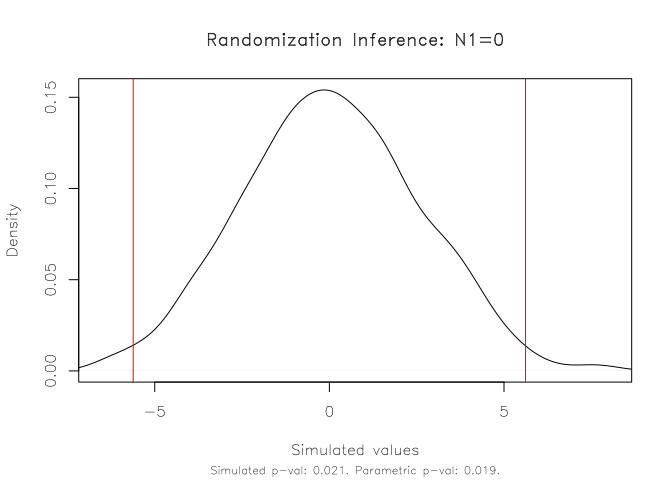
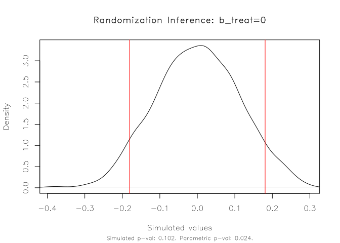

<!-- README.md is generated from README.Rmd. Please edit that file -->

# ritest

<!-- badges: start -->

[](https://github.com/grantmcdermott/ritest/actions)
<!-- badges: end -->

An experimental R port of the
**[`ritest`](https://github.com/simonheb)** Stata routine for
randomization inference (RI) by [Simon
Heß](https://github.com/simonheb).

Fast and user-friendly. Currently limited to `lm()` and
`fixest::feols()` models, but aims to support a variety of model classes
once it is fully baked.

## Installation

``` r
# install.packages("remotes")
remotes::install_github("grantmcdermott/ritest")
```

Note that **ritest** currently depends on the development version
(0.10.0) of **fixest**. If you’re on
[Windows](https://cran.r-project.org/bin/windows/Rtools/) or
[Mac](https://github.com/rmacoslib/r-macos-rtools#how-do-i-use-the-installer)
then you’ll need *Rtools* for compiling the underlying C++ code before
running the above command. (Click on the relevant link to install.)

## Examples

Let’s start by loading the **ritest** package. I’ll also load the
**fixest** and **haven** packages to help demonstrate some additional
functionality in the examples that follow.

``` r
library(ritest)
library(fixest) ## Note: ritest requires fixest version >= 0.10.0
library(haven)  ## For reading .dta files
```

The `ritest()` function supports a variety of arguments, but the basic
syntax is

``` r
ritest(object, resampvar, reps=100, strata=NULL, cluster=NULL, ...)
```

where:

-   `object` is a model object (e.g. a linear regression).
-   `resampvar` is the variable that you want to resample
    (i.e. permute).
-   `reps` is the number of simulations (i.e. permutations).
-   `strata` is a variable defining the stratification (aka “blocking”)
    of the experimental design, if any.
-   `cluster` is a variable defining the clustering of treatment in the
    experimental design, if any.
-   `...` are other arguments. This includes the ability to set a random
    seed for reproducibility, controlling the parallelism behaviour,
    adding a progress bar, etc. See `?ritest` for more information.

### Toy data

Our first example will be a rather naive implementation using the
inbuilt
[`nkp`](https://vincentarelbundock.github.io/Rdatasets/doc/MASS/npk.html)
dataset.

``` r
est = lm(yield ~ N + P + K, data = npk)
```

Let’s say we’re interested in the yield effect of ‘N’ (i.e. nitrogen).
We want to know whether our inferential reasoning about this parameter
is robust to using RI, as opposed to just relying on the parametric
t-test and p-value produced by our linear regression model. We’ll do
1,000 simulations and, just for illustration, limit the number of
parallel cores to 2. (The default parallel behaviour will use half of
the available cores on a user’s machine.) The ‘verbose = TRUE’ argument
simply prints the results upon completion, including the original
regression model summary.

``` r
# est_ri = ritest(est, ~N, reps = 1e3, seed = 1234L, pcores = 2L, verbose = TRUE) ## Formulas work too
est_ri = ritest(est, 'N', reps = 1e3, seed = 1234L, pcores = 2L, verbose = TRUE)
#> 
#> Running 1000 parallel RI simulations as forked processes across 2 CPU cores.
#> 
#> ******************
#> * ORIGINAL MODEL *
#> ******************
#> 
#> 
#> Call:
#> lm(formula = yield ~ N + P + K, data = npk)
#> 
#> Residuals:
#>     Min      1Q  Median      3Q     Max 
#> -9.2667 -3.6542  0.7083  3.4792  9.3333 
#> 
#> Coefficients:
#>             Estimate Std. Error t value Pr(>|t|)    
#> (Intercept)   54.650      2.205  24.784   <2e-16 ***
#> N1             5.617      2.205   2.547   0.0192 *  
#> P1            -1.183      2.205  -0.537   0.5974    
#> K1            -3.983      2.205  -1.806   0.0859 .  
#> ---
#> Signif. codes:  0 '***' 0.001 '**' 0.01 '*' 0.05 '.' 0.1 ' ' 1
#> 
#> Residual standard error: 5.401 on 20 degrees of freedom
#> Multiple R-squared:  0.3342, Adjusted R-squared:  0.2343 
#> F-statistic: 3.346 on 3 and 20 DF,  p-value: 0.0397
#> 
#> 
#> ******************
#> * RITEST RESULTS *
#> ******************
#> 
#> Call: lm(formula = yield ~ N + P + K, data = npk)
#> Res. var(s): N1
#> Strata var(s): 
#> Strata: 
#> Cluster var(s): 
#> Clusters: 
#> Num. reps: 1000
#> --- 
#>   T(obs)         c         n     p=c/n     SE(p)   CI 2.5%  CI 97.5%  
#>    5.617        21      1000     0.021  0.007462  0.008726   0.03327  
#> --- 
#> Note: Confidence interval is with respect to p=c/n 
#> Note: c = #{|T| >= |T(obs)|}
```

In this simple case, our parametric results appear to hold up very well.
The original p-value of 0.019 is very close to the equivalent rejection
rate of 0.021 that we get with our RI procedure.

We can also visualize this result using the default `plot` method. The
function takes several arguments for added customization. But here I’ll
just show how to add the parametric 95 percent confidence interval
(i.e. from the original linear regression) in addition the simulated
rejection regions.

``` r
plot(est_ri, show_parm = TRUE)
```



A more realistic implementation would control for the stratified (aka
“blocked”) experimental design. We’ll specify these strata (blocks) as
fixed-effects in our regression model. I’ll also use this as an
opportunity to show that that the package is fully compatible with
piping workflows. This might be useful if you don’t feel like saving
intermediate objects. Here I’ll use the new base R pipe (`|>`) that was
introduced in R 4.1.1, but the same thing would be possible with the
popular magrittr pipe (`%>%`).

``` r
# library(fixest) ## Already loaded

feols(yield ~ N + P + K | block, vcov = 'iid', data = npk) |>
  ritest('N', strata = 'block', reps = 1e3, seed = 99L)
#> 
#> Call: feols(fml = yield ~ N + P + K | block, data = npk, vcov = 'iid')
#> Res. var(s): N1
#> Strata var(s): block
#> Strata: 6
#> Cluster var(s): 
#> Clusters: 
#> Num. reps: 1000
#> --- 
#>    T(obs)          c          n      p=c/n      SE(p)    CI 2.5%   CI 97.5%  
#>     5.617          3       1000      0.003   0.002846  -0.001681   0.007681  
#> --- 
#> Note: Confidence interval is with respect to p=c/n 
#> Note: c = #{|T| >= |T(obs)|}
```

Again, we obtain an RI rejection rate (0.003) that is very similar to
the parametric p-value (0.004) from the regression model.

### Real-life data

Next, we’ll replicate an example in David McKenzie’s nice [blog
post](https://blogs.worldbank.org/impactevaluations/finally-way-do-easy-randomization-inference-stata)
about the Stata `ritest` routine. The dataset in question derives from a
randomized control trial about supply chains in Columbia. You can
download the data from David’s website
[here](https://drive.google.com/open?id=0B9C9RwWKZrUNazdyVXFkSTlTNGc)
(also includes code and data for some other examples.)

#### Stata implementation

First, here is the Stata code and output. I won’t go into detail about
the actual research question that we’re trying to address. (See David’s
blog post for more on that.) The essential thing to know is that I’m
going to run 5,000 RI permutations on a pretty standard fixed-effect
model, whilst accounting for the stratified and clustered design of the
experiment.

(Aside: I’m also snipping most of the Stata output, so as to only
highlight the main command and result.)

``` stata
. use "~/clusterColombia.dta", clear

. 
. timer on 1

. 
. ritest b_treat _b[b_treat], cluster(b_block) strata(b_pair) reps(5e3) seed(546): ///
> areg dayscorab b_treat b_dayscorab miss_b_dayscorab round2 round3, cluster(b_block) a(b_pair)

[snipped]


      command:  areg dayscorab b_treat b_dayscorab miss_b_dayscorab round2 round3, cluster(b_block)
                    a(b_pair)
        _pm_1:  _b[b_treat]
  res. var(s):  b_treat
   Resampling:  Permuting b_treat
Clust. var(s):  b_block
     Clusters:  63
Strata var(s):  b_pair
       Strata:  31

------------------------------------------------------------------------------
T            |     T(obs)       c       n   p=c/n   SE(p) [95% Conf. Interval]
-------------+----------------------------------------------------------------
       _pm_1 |   -.180738     529    5000  0.1058  0.0043  .0974064   .1146569
------------------------------------------------------------------------------
Note: Confidence interval is with respect to p=c/n.
Note: c = #{|T| >= |T(obs)|}

. 
. timer off 1
```

Like David, this takes around **3 minutes** to run on my laptop.

``` stata
. timer list
   1:    183.01 /        1 =     183.0150
```

#### R implementation

Now, the R equivalent with this package.

``` r
co = haven::read_dta('~/clusterColombia.dta')

co_est = 
  feols(
    dayscorab ~ b_treat + b_dayscorab + miss_b_dayscorab + round2 + round3 | b_pair, 
    vcov = ~b_block, data = co
    )
#> NOTE: 1,020 observations removed because of NA values (LHS: 1,020).

tic = Sys.time()
co_ri = ritest(co_est, ~b_treat, cluster=~b_block, strata=~b_pair, reps=5e3, seed=546L)
toc = Sys.time() - tic

## Print the results
co_ri
#> 
#> Call: feols(fml = dayscorab ~ b_treat + b_dayscorab + miss_b_dayscorab + round2 + round3 | b_pair, data = co, vcov = ~b_block)
#> Res. var(s): b_treat
#> Strata var(s): b_pair
#> Strata: 31
#> Cluster var(s): b_block
#> Clusters: 63
#> Num. reps: 5000
#> --- 
#>   T(obs)         c         n     p=c/n     SE(p)   CI 2.5%  CI 97.5%  
#>  -0.1807       520      5000     0.104  0.007102   0.09232    0.1157  
#> --- 
#> Note: Confidence interval is with respect to p=c/n 
#> Note: c = #{|T| >= |T(obs)|}
```

Using the same random seed is a bit of performance art. We won’t get
exactly the same results across two different languages. But the
important thing to note is that they are functionally equivalent
(rejection probability of 0.106 vs 0.104).

One nice feature of this implementation is that it should complete very
quickly. This time, the 5,000 simulations only take around **6
seconds**.

``` r
toc
#> Time difference of 6.362944 secs
```

Again, we can plot the results. Here’s a slight variation, where we plot
in histogram form and use a fill to highlight the 95% rejection
region(s) instead of vertical lines.

``` r
plot(co_ri, type = 'hist', highlight = 'fill')
```



### Benchmarks

As indicated in the real-life data example, I generally observe a speed
increase of around 30x compared to the Stata version. This gap appears
to widen further for larger datasets and for certain kinds of RI setups.
