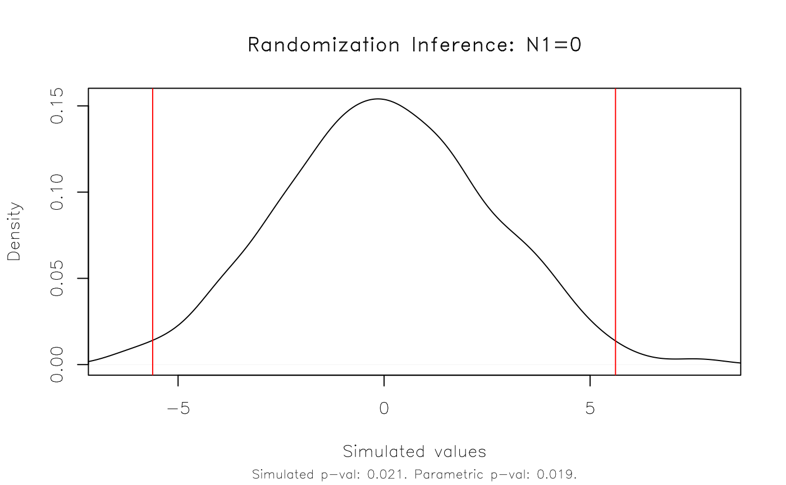
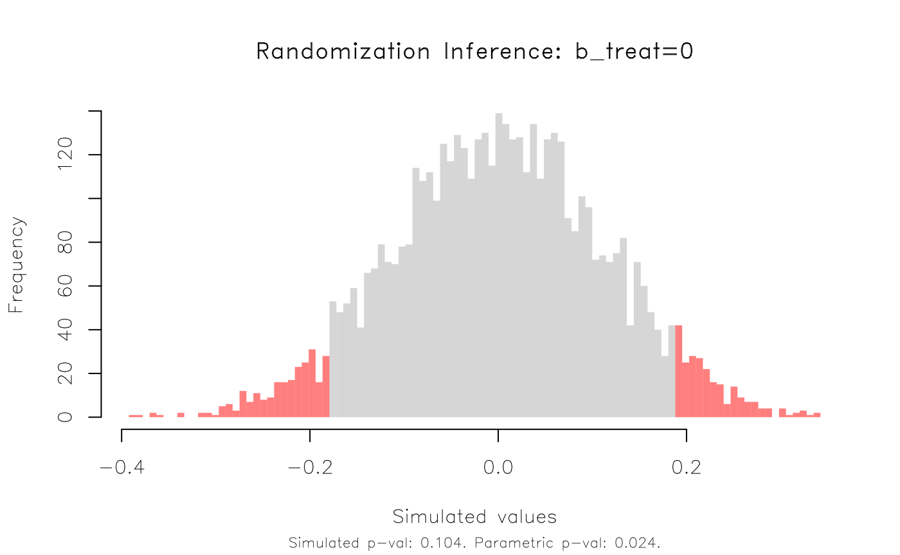
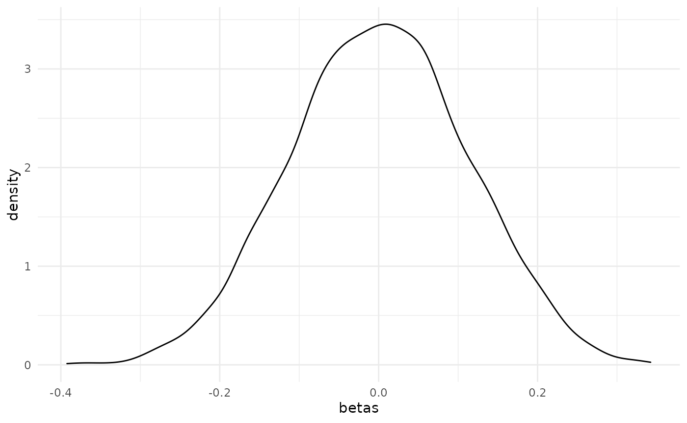
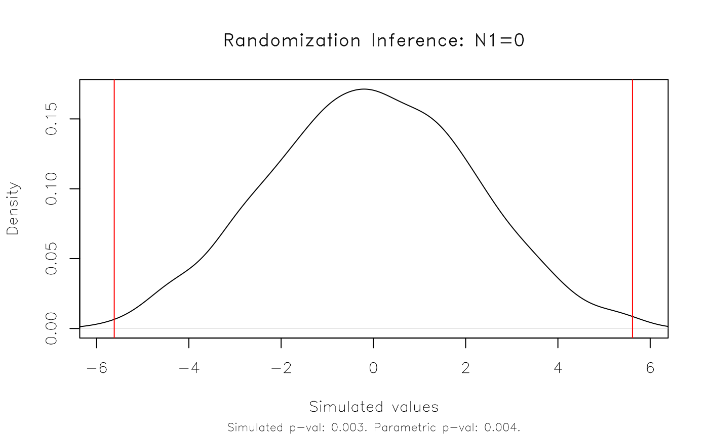

# Introduction to ritest

Let’s start by loading the **ritest** package. I’ll also be using one or
two outside packages in the examples that follow to demonstrate some
additional functionality, but will hold off loading those for now.

``` r
library(ritest)
```

The [`ritest()`](http://grantmcdermott.com/ritest/reference/ritest.md)
function supports a variety of arguments, but the basic syntax is

``` r
ritest(object, resampvar, reps=100, strata=NULL, cluster=NULL, ...)
```

where:

- `object` is a model object (e.g. a linear regression).
- `resampvar` is the variable that you want to resample (i.e. permute).
  You can also specify the sharp null hypothesis that you want to test
  as part of a character string.
- `reps` is the number of simulations (i.e. permutations).
- `strata` is a variable defining the stratification (aka “blocking”) of
  the experimental design, if any.
- `cluster` is a variable defining the clustering of treatment in the
  experimental design, if any.
- `...` are other arguments. This includes the ability to set a random
  seed for reproducibility, controlling the parallelism behaviour,
  adding a progress bar, etc. See
  [`?ritest`](http://grantmcdermott.com/ritest/reference/ritest.md) for
  more information.

Let’s see this functionality in action with the help of some examples.

## Example I: Toy data

Our first example will be a rather naive implementation using the base
[`nkp`](https://vincentarelbundock.github.io/Rdatasets/doc/MASS/npk.html)
dataset.

``` r
est = lm(yield ~ N + P + K, data = npk)
```

Let’s say we’re interested in the yield effect of ‘N’ (i.e. nitrogen).
We want to know whether our inferential reasoning about this parameter
is robust to using RI, as opposed to just relying on the parametric
t-test and p-value produced by our linear regression model. We’ll do
1,000 simulations and, just for illustration, limit the number of
parallel cores to 2. (The default parallel behaviour will use half of
the available cores on a user’s machine.) The ‘verbose = TRUE’ argument
simply prints the results upon completion, including the original
regression model summary.

``` r
est_ri = ritest(est, 'N', reps = 1e3, seed = 1234L, pcores = 2L, verbose = TRUE)
#> 
#> Running 1000 parallel RI simulations as forked processes across 2 CPU cores.
#> 
#> ******************
#> * ORIGINAL MODEL *
#> ******************
#> 
#> Call:
#> lm(formula = yield ~ N + P + K, data = npk)
#> 
#> Residuals:
#>     Min      1Q  Median      3Q     Max 
#> -9.2667 -3.6542  0.7083  3.4792  9.3333 
#> 
#> Coefficients:
#>             Estimate Std. Error t value Pr(>|t|)    
#> (Intercept)   54.650      2.205  24.784   <2e-16 ***
#> N1             5.617      2.205   2.547   0.0192 *  
#> P1            -1.183      2.205  -0.537   0.5974    
#> K1            -3.983      2.205  -1.806   0.0859 .  
#> ---
#> Signif. codes:  0 '***' 0.001 '**' 0.01 '*' 0.05 '.' 0.1 ' ' 1
#> 
#> Residual standard error: 5.401 on 20 degrees of freedom
#> Multiple R-squared:  0.3342, Adjusted R-squared:  0.2343 
#> F-statistic: 3.346 on 3 and 20 DF,  p-value: 0.0397
#> 
#> 
#> ******************
#> * RITEST RESULTS *
#> ******************
#> 
#>           Call: lm(formula = yield ~ N + P + K, data = npk)
#>    Res. var(s): N1
#>             H0: N1=0
#>      Num. reps: 1000
#> ──────────────────────────────────────────────────────────────────────────────── 
#>   T(obs)         c         n     p=c/n     SE(p)   CI 2.5%  CI 97.5%  
#>    5.617        21      1000     0.021  0.007462  0.008726   0.03327  
#> ──────────────────────────────────────────────────────────────────────────────── 
#> Note: Confidence interval is with respect to p=c/n. 
#> Note: c = #{|T| >= |T(obs)|}
```

In this simple case, our parametric results appear to hold up very well.
The original p-value of 0.019 is very close to the equivalent rejection
rate of 0.021 that we get with our RI procedure.

We can also visualize this result using the dedicated `plot` method. The
function takes several arguments for added customization. But here I’ll
just show the default plot, which includes vertical lines that denote
the simulated (in this case: 95 percent) rejection regions.

``` r
plot(est_ri)
```



As an aside, note that the RI procedure tests against a standard
two-sided null hypothesis of zero. (In the above case: `H0: N1=0`.) We
can specify a different null hypothesis as part of the `resampvar`
string. For example:

``` r
plot(ritest(est, 'N<=2', reps = 1e3, seed = 1234L, pcores = 2L))
```


Note that we could (and probably should) have estimated a more realistic
model that controls for the stratified (aka “blocked”) design of the
original `npk` experiment. This is easily done, but we’ll hold off doing
so for now since the the discussion of strata provides a nice segue to
our next example.

## Example II: Real-life data

Our second example will provide a more realistic use-case, where we need
to account for a *stratified* and *clustered* research design. In
particular, we’ll replicate a real-life experiment that David McKenzie
describes in a very helpful [blog
post](https://blogs.worldbank.org/impactevaluations/finally-way-do-easy-randomization-inference-stata)
on the original Stata `-ritest-` routine.

The dataset in question derives from a randomized control trial about
supply chains in Colombia, which David has kindly provided for re-use in
this package (see:
[`?colombia`](http://grantmcdermott.com/ritest/reference/colombia.md)).
The key research question that we’re trying to answer below is whether a
treatment intervention (`b_treat`) led to a drop in the number of days
requiring visits to the *Corabastos* central market.[¹](#fn1) Moreover,
we want to know if our inference about this treatment effect is robust
to RI.

### Stata implementation

As a benchmark, first we recapitulate David’s Stata code and output. I
won’t go into details — the essential thing to know is that I’m going to
run 5,000 RI permutations on a pretty standard fixed-effect model,
whilst accounting for the stratified and clustered design of the
experiment.

(Aside: I’m also snipping most of the Stata output, so as to only
highlight the main command and result.)

``` stata
. // This next line assumes you have exported the `colombia` dataset from R as a
. // CSV for Stata to read, e.g. `write.csv(colombia, '~/colombia.csv', row.names = FALSE)`
. insheet using "~/colombia.csv", comma clear

. 
. timer on 1

. 
. ritest b_treat _b[b_treat], cluster(b_block) strata(b_pair) reps(5e3) seed(546): ///
> areg dayscorab b_treat b_dayscorab miss_b_dayscorab round2 round3, cluster(b_block) a(b_pair)

[snipped]


      command:  areg dayscorab b_treat b_dayscorab miss_b_dayscorab round2 round3, cluster(b_block)
                    a(b_pair)
        _pm_1:  _b[b_treat]
  res. var(s):  b_treat
   Resampling:  Permuting b_treat
Clust. var(s):  b_block
     Clusters:  63
Strata var(s):  b_pair
       Strata:  31

------------------------------------------------------------------------------
T            |     T(obs)       c       n   p=c/n   SE(p) [95% Conf. Interval]
-------------+----------------------------------------------------------------
       _pm_1 |   -.180738     529    5000  0.1058  0.0043  .0974064   .1146569
------------------------------------------------------------------------------
Note: Confidence interval is with respect to p=c/n.
Note: c = #{|T| >= |T(obs)|}

. 
. timer off 1
```

Like David, this takes around **3 minutes** to run on my laptop.

``` stata
. timer list
   1:    183.01 /        1 =     183.0150
```

### R implementation

Let’s replicate the above in R using this package. First, we’ll estimate
and save the parametric model using
[`fixest::feols()`](https://lrberge.github.io/fixest/reference/feols.html).

``` r
data("colombia")

library(fixest) ## For fast (high-dimensional) fixed-effects models

co_est = 
  feols(
    dayscorab ~ b_treat + b_dayscorab + miss_b_dayscorab | b_pair + round2 + round3, 
    vcov = ~b_block, data = colombia
  )
#> NOTE: 1,020 observations removed because of NA values (LHS: 1,020).
co_est
#> OLS estimation, Dep. Var.: dayscorab
#> Observations: 2,346
#> Fixed-effects: b_pair: 31,  round2: 2,  round3: 2
#> Standard-errors: Clustered (b_block) 
#>                   Estimate Std. Error  t value  Pr(>|t|)    
#> b_treat          -0.180738   0.078174 -2.31201  0.024113 *  
#> b_dayscorab       0.524761   0.029423 17.83478 < 2.2e-16 ***
#> miss_b_dayscorab  0.603928   0.264174  2.28610  0.025678 *  
#> ---
#> Signif. codes:  0 '***' 0.001 '**' 0.01 '*' 0.05 '.' 0.1 ' ' 1
#> RMSE: 1.91167     Adj. R2: 0.282038
#>                 Within R2: 0.266002
```

Now, we conduct RI on our model to see whether our key treatment
variable (`b_treat`) is sensitive to the imposed parametric constraints.
Note that we can specify the strata and clusters as additional arguments
to [`ritest()`](http://grantmcdermott.com/ritest/reference/ritest.md).

``` r
tic = Sys.time() ## timer on

co_ri = ritest(co_est, 'b_treat', cluster='b_block', strata='b_pair', reps=5e3, seed=546L)

toc = Sys.time() - tic ## timer off

## Print the results
co_ri
#> 
#>           Call: feols(fml = dayscorab ~ b_treat + b_dayscorab + miss_b_dayscorab | b_pair + round2 + round3, data = colombia, vcov = ~b_block)
#>    Res. var(s): b_treat
#>             H0: b_treat=0
#>  Strata var(s): b_pair
#>         Strata: 31
#> Cluster var(s): b_block
#>       Clusters: 63
#>      Num. reps: 5000
#> ──────────────────────────────────────────────────────────────────────────────── 
#>   T(obs)         c         n     p=c/n     SE(p)   CI 2.5%  CI 97.5%  
#>  -0.1807       520      5000     0.104  0.007102   0.09232    0.1157  
#> ──────────────────────────────────────────────────────────────────────────────── 
#> Note: Confidence interval is with respect to p=c/n. 
#> Note: c = #{|T| >= |T(obs)|}
```

Using the same random seed in R and Stata is a bit of performance art.
We won’t get exactly the same results across two different languages.
But the important thing to note is that they are functionally equivalent
(rejection probability of 0.106 vs 0.104). More importantly, we can see
that our inference about the effectiveness of treatment in this study is
indeed sensitive to RI. Our parametric p-value (0.024) is much lower
than the permuted rejection rate (0.104).

Again, we can plot the results. Here’s a slight variation, where we plot
in histogram form and use a fill to highlight the 95% rejection
region(s) instead of vertical lines.

``` r
plot(co_ri, type = 'hist', highlight = 'fill')
```



### Benchmarks

One nice feature of the R implementation is that it should complete very
quickly. Instead of taking 3 minutes, this time the 5,000 simulations
only take around **6 seconds**.

``` r
toc
#> Time difference of 6.581697 secs
```

As a general observation, the R implementation of
[`ritest()`](http://grantmcdermott.com/ritest/reference/ritest.md)
doesn’t yet offer all of the functionality of the Stata version. For
example, it doesn’t support an external file of resampling weights.
However, it does appear to be a lot (25x – 50x) faster and this might
make it more suitable for certain types of problems.

## Extras and asides

### Regression tables

Support for regression tables is enabled via **ritest’s** compatability
with the **modelsummary** package. I recommend displaying p-values
instead of the default standard errors. This is particularly important
when comparing against a parametric model, as I do below.

``` r
library(modelsummary)

msummary(list(lm = co_est, ritest = co_ri), 
         statistic = 'p.value', 
         ## These next arguments just make our comparison table look a bit nicer
         coef_map = c('b_treat' = 'Treatment'), 
         gof_omit = 'Obs|R2|IC|Log|F',
         notes = 'p-values shown in parentheses.')
```

|                                | lm          | ritest    |
|--------------------------------|-------------|-----------|
| Treatment                      | -0.181      | -0.181    |
|                                | (0.024)     | (0.104)   |
| RMSE                           | 1.91        |           |
| Std.Errors                     | by: b_block |           |
| H0                             |             | b_treat=0 |
| Num.Reps                       |             | 5000      |
| Strata                         |             | b_pair    |
| Clusters                       |             | b_block   |
| p-values shown in parentheses. |             |           |

### NSE and formula arguments

If you don’t feel like quoting the variable arguments (i.e. `resampvar`
& co.), then you can also pass them as unquoted NSE or one-side
formulas. For example:

``` r
# ritest(co_est, 'b_treat', strata = 'b_pair', cluster = 'b_block') # strings
# ritest(co_est, ~b_treat, strata = ~b_pair, cluster = ~b_block)    # formulae
ritest(co_est, b_treat, strata = b_pair, cluster = b_block)         # NSE
#> 
#>           Call: feols(fml = dayscorab ~ b_treat + b_dayscorab + miss_b_dayscorab | b_pair + round2 + round3, data = colombia, vcov = ~b_block)
#>    Res. var(s): b_treat
#>             H0: b_treat=0
#>  Strata var(s): b_pair
#>         Strata: 31
#> Cluster var(s): b_block
#>       Clusters: 63
#>      Num. reps: 100
#> ──────────────────────────────────────────────────────────────────────────────── 
#>   T(obs)         c         n     p=c/n     SE(p)   CI 2.5%  CI 97.5%  
#>  -0.1807        12       100      0.12   0.05372   0.03164    0.2084  
#> ──────────────────────────────────────────────────────────────────────────────── 
#> Note: Confidence interval is with respect to p=c/n. 
#> Note: c = #{|T| >= |T(obs)|}
```

### ggplot2

If you don’t like the default plot method and would prefer to use
**ggplot2**, then that’s easily done. Just extract the beta values from
the return object.

``` r
library(ggplot2)

ggplot(data.frame(betas = co_ri$betas), aes(betas)) + 
  geom_density() +
  theme_minimal()
```



### Piping workflows

The **ritest** package is fully compatible with piping workflows. This
might be useful if you don’t feel like saving intermediate objects. Here
is is a simple example using the base `|>` pipe that was introduced in R
4.1.0.

``` r
feols(yield ~ N + P + K | block, vcov = 'iid', data = npk) |> # model
  ritest('N', strata = 'block', reps = 1e3, seed = 99L) |>    # ritest
  plot()                                                      # plot
```



------------------------------------------------------------------------

1.  Repeated visits to the market are an expensive and time-consuming
    exercise for the fresh produce vendors that formed the study
    population.
